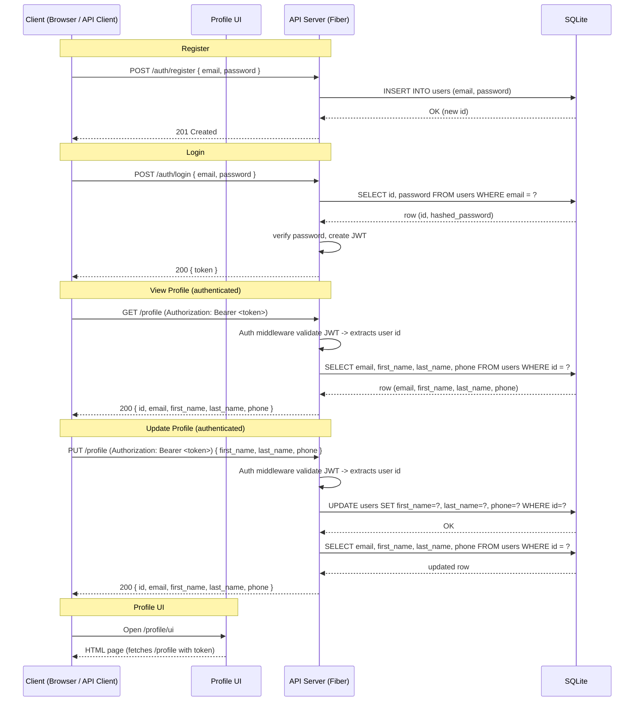
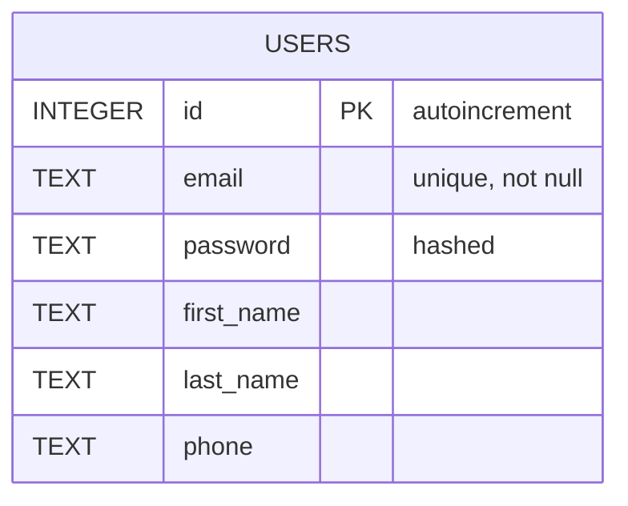

# API Detail

This document describes the request flow for user registration, authentication, profile retrieval and update, and the database schema. Diagrams are provided in Mermaid format.

## Sequence Diagram

## ER Diagram

## Notes
- JWT: The server issues a signed JWT on /auth/login. The token must be provided as an Authorization header: `Bearer <token>` for protected endpoints.
- Migration: If you already have an existing SQLite database without profile columns, add columns with:
  - ALTER TABLE users ADD COLUMN first_name TEXT;
  - ALTER TABLE users ADD COLUMN last_name TEXT;
  - ALTER TABLE users ADD COLUMN phone TEXT;

- Rendering: Many Markdown viewers (VS Code, GitHub) can render Mermaid diagrams with appropriate plugins or built-in support. Use a Mermaid live editor to preview if needed.
